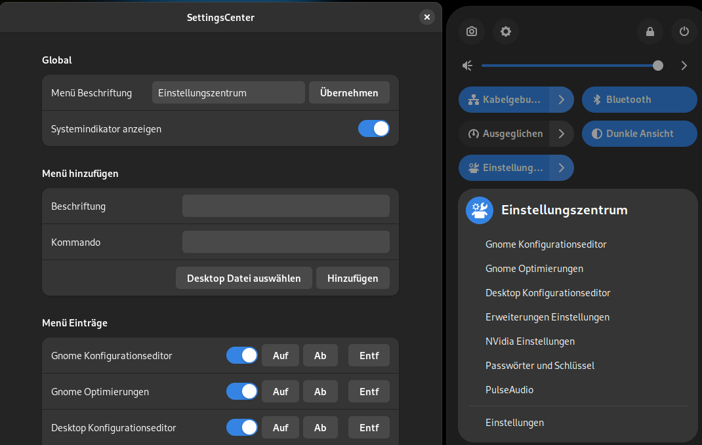
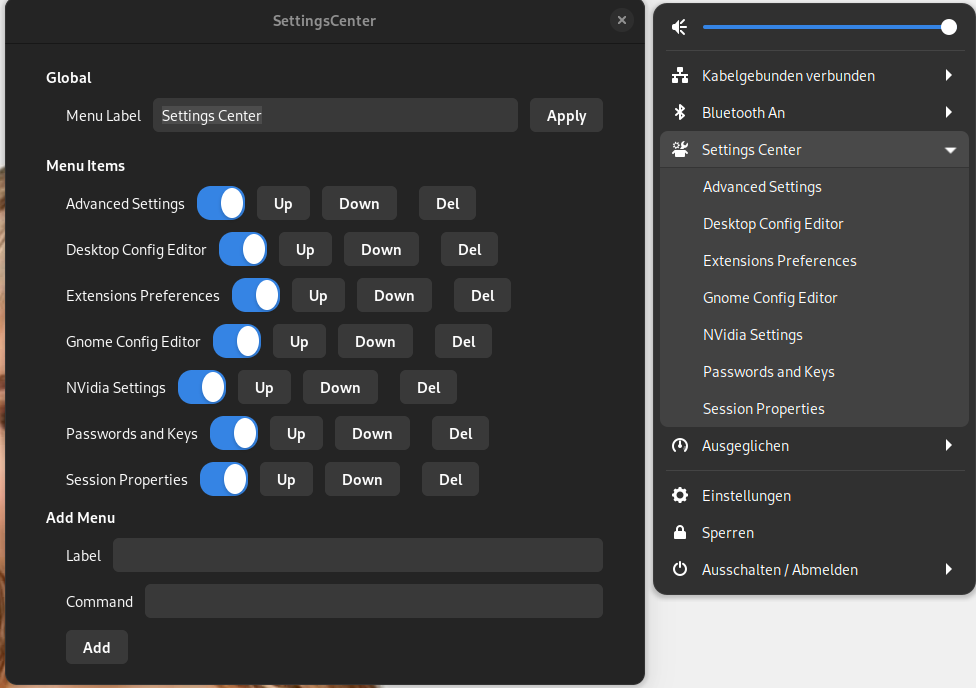

  

### Description:

Settings Center is a customizable drop-down menu for quickly launching frequently used apps in Gnome:Shell via the quick settings menu. Originally created by XES / l300lvl.

Settings shortcuts : gnome-tweak-tool, dconf-editor, gconf-editor, gnome-session-properties, gnome-shell-extension-prefs, seahorse and nvidia-settings. You can add your own

Original source : https://github.com/l300lvl/XES-Settings-Center-Extension

Make sure you have gnome-icon-theme package installed.

### 1 click install from E.G.O:

### Screenshot GNOME 43 and newer

### Screenshot GNOME 3.x

## Contributing

Pull requests are welcome.

To update the translation files run `./settingscenter.sh translate` in the extensions directory after your code changes are finished. This will update the files in po folder. Then poedit (https://poedit.net/download) can be used to translate the strings. poedit can also be used to create new localization files.

# ✨️ Contributors

